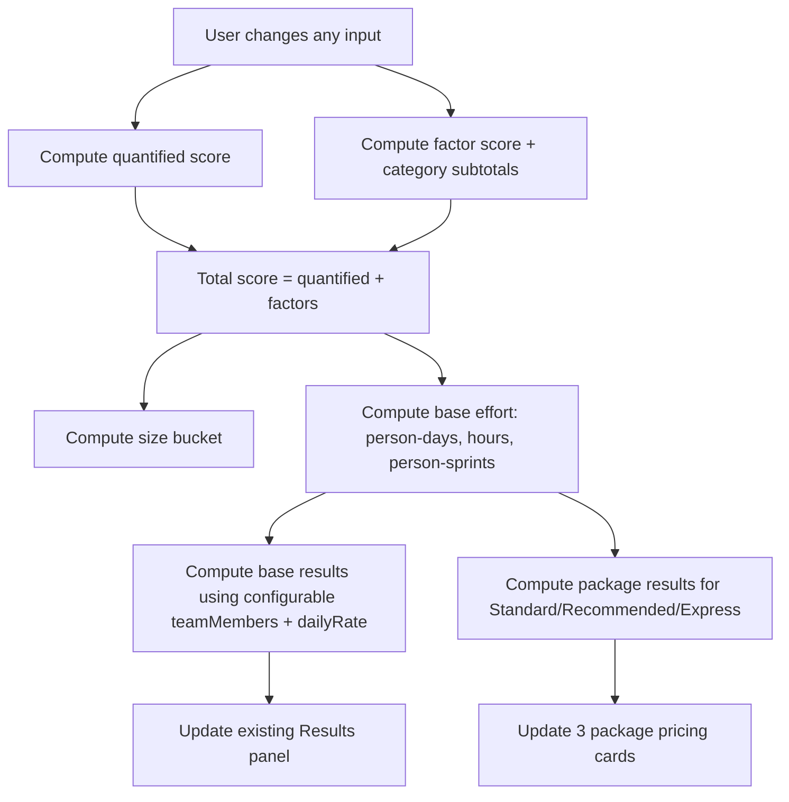

# Modifying a Migration Sizing Tool to Add Three Pricing Packages

## Assumptions

I’m making these assumptions because your request specifies package team caps but doesn’t fully specify pricing policy:

- **Baseline daily rate** is whatever the user enters in the existing **Daily Rate** field, and I treat that as the **Recommended** package baseline.
- **Packages differentiate on two axes**:
  - **Schedule compression** via a **team size cap** (Standard 3 / Recommended 6 / Express 9).
  - **Commercial pricing** via a **rate multiplier** applied to the baseline daily rate.
- Default multipliers (you can tune later):
  - **Standard** multiplier = **0.95** (small discount)
  - **Recommended** multiplier = **1.00**
  - **Express** multiplier = **1.20** (rush premium)
- **Effort does not change** between packages (same scope/score). Only **timeline and cost** change.
- “Sprints” are capacity units driven by your existing **Sprint capacity (hours per sprint per person)** input, not necessarily 2-week sprints.
- Currency/locale: no constraints; I keep `$` output consistent with your current UI, and I don’t add FX or locale switches.

## Executive summary

You asked, “What do I need to update in GitHub to make this function how I want?” Here’s the blunt answer:

- Your **EasySizingTool GitHub repo appears empty/no files**, so you can’t “update it” into the desired tool until you **commit the actual HTML/CSS/JS** (e.g., `index.html`, `migrationtool.css`, and any JS files). Once the files exist, your changes are straightforward: add **three package cards**, update the **calculation JS** to compute per-package outputs, and fix the **axe accessibility failures** (labels + select naming).  
- Your posted Edge errors match Deque’s axe rules: every **select** must have an accessible name, and every **form control** (including table checkboxes) must have a programmatic label association. citeturn0search0turn0search1
- For the package UI, established pricing-card guidance says to keep plan count low (≤4), highlight a “Recommended” option with a badge/button treatment, and focus on differences—not a bloated feature list. citeturn0search3turn2search0turn2search3
- For migration sizing, your factors (downtime tolerance, strategy choice, dependencies, operational readiness) align with what Microsoft CAF and AWS Prescriptive Guidance call out as high-impact drivers that shape method selection and planning rigor. citeturn1search6turn1search8turn1search2turn1search4

**Limitation:** I could not find code in the EasySizingTool GitHub repo (it appears empty), so the “current app inputs → weights” mapping below reflects the current tool structure you’ve been iterating on in this conversation (dropdown quantified inputs + boolean factor keys + WEIGHTS object). If your GitHub version differs, you’ll want to sync it first.

## Information needs and source coverage

### Enabled connectors

Enabled connectors (as requested): **github**.

### What I needed to learn to answer well

I focused on 6 concrete information needs:

1. Whether your GitHub repo contains the sizing tool code, and what files/structure it uses.
2. The current **inputs-to-score** mapping (quantified dropdown fields and boolean factors + weights).
3. Accessibility requirements for the exact failures you pasted (axe `select-name`, axe `label`).
4. Pricing-card UX patterns for three plan cards (including “Recommended” highlighting).
5. Migration sizing best practices to validate your factor model (CAF + AWS).
6. A maintainable migration path from in-code weights to enum files later.

### External primary sources I used

- **Deque University / axe rules** for the exact violations you’re seeing (select name, control labels). citeturn0search0turn0search1
- **Twilio Paste pricing pattern** for plan-card structure and “recommended” emphasis. citeturn0search3
- **Smashing Magazine** pricing-table/card best practices (minimum clutter, emphasize price, communicate differences). citeturn2search0turn2search3
- **Microsoft Cloud Adoption Framework** guidance for migration method selection (downtime vs near-zero downtime) and rationalization strategies. citeturn1search6turn1search8
- **AWS Prescriptive Guidance** for migration strategies (7 Rs) and portfolio analysis/planning emphasis on dependencies and high-fidelity data. citeturn1search0turn1search2turn1search7

## Current app inputs mapped to scoring and weights

This section is the “what the app is currently doing” → “how we compute packages.”

### Quantified fields (dropdowns)

These are **range selectors** where the `<option value="…">` contributes directly to score.

| UI label | Key/ID | Type | Score method |
|---|---|---|---|
| Active Users | `q_users` | dropdown | add numeric option value |
| Total Data Size | `q_data` | dropdown | add numeric option value |
| VM Count | `q_vms` | dropdown | add numeric option value |
| Database Count | `q_dbs` | dropdown | add numeric option value |
| Uptime Requirement | `q_uptime` | dropdown | add numeric option value |
| Integration Count | `q_integrations` | dropdown | add numeric option value |

### Boolean factors (checkboxes + WEIGHTS)

These are **yes/no** items. Each checked box adds its weight.

| Category | Key | Weight |
|---|---|---:|
| Infrastructure | `infra_expressroute` | 8 |
| Infrastructure | `infra_hybrid` | 6 |
| Infrastructure | `infra_lb` | 5 |
| Infrastructure | `infra_firewall` | 5 |
| Infrastructure | `infra_segmentation` | 4 |
| Infrastructure | `infra_ha` | 7 |
| Infrastructure | `infra_zerodowntime` | 10 |
| Infrastructure | `infra_dr` | 6 |
| Infrastructure | `infra_monitoring` | 5 |
| Security & Identity | `sec_identity` | 6 |
| Security & Identity | `sec_rbac` | 5 |
| Security & Identity | `sec_secrets` | 4 |
| Security & Identity | `sec_tls` | 3 |
| Security & Identity | `sec_encryption` | 5 |
| Security & Identity | `sec_compliance` | 7 |
| Application Engineering | `app_refactor` | 9 |
| Application Engineering | `app_framework` | 6 |
| Application Engineering | `app_container` | 7 |
| Application Engineering | `app_cicd` | 5 |
| Application Engineering | `app_dependencies` | 5 |
| Application Engineering | `app_vendor` | 4 |
| Database | `db_migrate` | 7 |
| Database | `db_refactor` | 8 |
| Database | `db_cluster` | 6 |
| Database | `db_transform` | 6 |
| Database | `db_perf` | 7 |

### Why this model is defensible

- CAF explicitly distinguishes **downtime migration** vs **near-zero downtime migration** based on downtime tolerance and criticality, supporting your `infra_zerodowntime`/uptime inputs. citeturn1search6
- CAF rationalization strategy selection (rehost/replatform/refactor/etc.) indicates effort varies meaningfully by strategy, which supports keeping “refactor”/engineering complexity factors separate and visible. citeturn1search8
- AWS emphasizes that portfolio analysis/planning requires dependency identification and higher-fidelity data—supporting your dependency/integration factors and your quantified ranges that proxy “data gravity” and “surface area.” citeturn1search2turn1search7

## Proposed pricing formulas for Standard, Recommended, Express

### Base scoring and effort math

Let:

- `S` = **total score**
- `B` = **base person-days per point** (existing input)
- `H` = **hours per person-day** (existing input)
- `SH` = **sprint hours per sprint per person** (existing input)
- `R` = **baseline daily rate** (existing input)

Then:

- **PersonDays** = `S × B`
- **TotalHours** = `PersonDays × H`
- **PersonSprints** = `TotalHours ÷ SH` (when `SH > 0`)

### Package layer math

Each package `p` has:

- `Cap_p` = team size cap (3 / 6 / 9)
- `M_p` = rate multiplier (0.95 / 1.00 / 1.20 by default)

Then:

- **Rate_p** = `R × M_p`
- **Cost_p** = `PersonDays × Rate_p`
- **CalendarSprints_p** = `PersonSprints ÷ Cap_p`

This meets your package requirement while keeping the estimator honest: same scope → same effort; team size changes schedule; pricing multiplier changes cost.

### Why the UI should present it this way

The Twilio Paste pricing pattern recommends limiting plans (≤4), using a badge/button emphasis for the recommended plan, and focusing feature lists on differences. citeturn0search3 Smashing Magazine similarly emphasizes communicating differences, reducing clutter, and making price visually prominent. citeturn2search0turn2search3

## UI/HTML, accessibility, CSS, and full JS implementation

### Calculation flow diagram



### Accessible HTML snippet: three package result cards

Paste this where you want the package outputs to appear (typically after your main Results card). This uses semantic headings, keeps cards to 3 plans, and includes a recommended badge—aligned with Paste guidance. citeturn0search3

```html
<div class="card">
  <h2>Service Packages</h2>
  <p class="desc">
    Same scope score; different staffing caps and pricing multipliers. Calendar sprints assume full utilization up to the cap.
  </p>

  <div class="pricing-grid" role="list" aria-label="Service packages">
    <section class="pricing-card" role="listitem" aria-labelledby="pkg-standard-title">
      <header class="pricing-header">
        <h3 id="pkg-standard-title">Standard</h3>
        <div class="pricing-sub">Up to <strong>3</strong> people</div>
      </header>

      <div class="pricing-price">
        <div class="pricing-price-label">Estimated Cost</div>
        <div class="pricing-price-value">
          <span class="pricing-currency">$</span><span id="pkg-standard-cost">0</span>
        </div>
      </div>

      <dl class="pricing-kv">
        <div class="pricing-kv-row"><dt>Daily rate</dt><dd id="pkg-standard-rate">$0</dd></div>
        <div class="pricing-kv-row"><dt>Person-days</dt><dd id="pkg-standard-days">0</dd></div>
        <div class="pricing-kv-row"><dt>Total hours</dt><dd id="pkg-standard-hours">0</dd></div>
        <div class="pricing-kv-row"><dt>Person-sprints</dt><dd id="pkg-standard-personSprints">0</dd></div>
        <div class="pricing-kv-row"><dt>Calendar sprints</dt><dd id="pkg-standard-calendarSprints">0</dd></div>
      </dl>
    </section>

    <section class="pricing-card pricing-featured" role="listitem" aria-labelledby="pkg-recommended-title">
      <header class="pricing-header">
        <div class="pricing-badge" aria-hidden="true">Recommended</div>
        <h3 id="pkg-recommended-title">Recommended</h3>
        <div class="pricing-sub">Up to <strong>6</strong> people</div>
      </header>

      <div class="pricing-price">
        <div class="pricing-price-label">Estimated Cost</div>
        <div class="pricing-price-value">
          <span class="pricing-currency">$</span><span id="pkg-recommended-cost">0</span>
        </div>
      </div>

      <dl class="pricing-kv">
        <div class="pricing-kv-row"><dt>Daily rate</dt><dd id="pkg-recommended-rate">$0</dd></div>
        <div class="pricing-kv-row"><dt>Person-days</dt><dd id="pkg-recommended-days">0</dd></div>
        <div class="pricing-kv-row"><dt>Total hours</dt><dd id="pkg-recommended-hours">0</dd></div>
        <div class="pricing-kv-row"><dt>Person-sprints</dt><dd id="pkg-recommended-personSprints">0</dd></div>
        <div class="pricing-kv-row"><dt>Calendar sprints</dt><dd id="pkg-recommended-calendarSprints">0</dd></div>
      </dl>
    </section>

    <section class="pricing-card" role="listitem" aria-labelledby="pkg-express-title">
      <header class="pricing-header">
        <h3 id="pkg-express-title">Express</h3>
        <div class="pricing-sub">Up to <strong>9</strong> people</div>
      </header>

      <div class="pricing-price">
        <div class="pricing-price-label">Estimated Cost</div>
        <div class="pricing-price-value">
          <span class="pricing-currency">$</span><span id="pkg-express-cost">0</span>
        </div>
      </div>

      <dl class="pricing-kv">
        <div class="pricing-kv-row"><dt>Daily rate</dt><dd id="pkg-express-rate">$0</dd></div>
        <div class="pricing-kv-row"><dt>Person-days</dt><dd id="pkg-express-days">0</dd></div>
        <div class="pricing-kv-row"><dt>Total hours</dt><dd id="pkg-express-hours">0</dd></div>
        <div class="pricing-kv-row"><dt>Person-sprints</dt><dd id="pkg-express-personSprints">0</dd></div>
        <div class="pricing-kv-row"><dt>Calendar sprints</dt><dd id="pkg-express-calendarSprints">0</dd></div>
      </dl>
    </section>
  </div>
</div>
```

### Accessibility fixes for your axe errors

Deque’s axe guidance is explicit:

- Each `<select>` must have an accessible name (usually a programmatically associated `<label>`). citeturn0search0
- Each form control (inputs, checkboxes, radios, selects, textareas) must have an associated label. citeturn0search1

#### Label `for` / `id` pattern (selects + inputs)

```html
<label for="q_users">Active Users</label>
<select id="q_users" data-quant="q_users">
  <option value="1">1–10</option>
  <option value="3">11–50</option>
</select>
```

#### Table checkbox pattern with visually-hidden label

This prevents “checkbox has no label” while keeping your table layout unchanged.

```html
<td class="centered-cell">
  <input id="factor-infra-expressroute" type="checkbox" data-factor="infra_expressroute" />
  <label for="factor-infra-expressroute" class="sr-only">ExpressRoute Required</label>
</td>
```

### CSS helper classes (including sr-only and pricing styles)

Twilio Paste recommends using badges sparingly and highlighting only a recommended plan. citeturn0search3 Smashing also warns against clutter and encourages clear hierarchy. citeturn2search0turn2search3 The CSS below supports that without changing your app structure.

```css
/* Screen-reader-only utility (Deque-friendly invisible label pattern) */
.sr-only {
  position: absolute !important;
  width: 1px !important;
  height: 1px !important;
  padding: 0 !important;
  margin: -1px !important;
  overflow: hidden !important;
  clip: rect(0, 0, 0, 0) !important;
  white-space: nowrap !important;
  border: 0 !important;
}

/* Replace inline styles */
.w-120 { width: 120px; }
.full-width { grid-column: 1 / -1; }

/* Pricing packages layout */
.pricing-grid {
  display: grid;
  grid-template-columns: repeat(auto-fit, minmax(240px, 1fr));
  gap: 0.75rem;
}

.pricing-card {
  background: #020617;
  border: 1px solid #1f2937;
  border-radius: 0.75rem;
  padding: 1rem;
  box-shadow: 0 10px 25px rgba(0,0,0,0.35);
}

.pricing-featured {
  border-color: #38bdf8;
}

.pricing-header {
  display: flex;
  flex-direction: column;
  gap: 0.25rem;
  margin-bottom: 0.75rem;
}

.pricing-badge {
  display: inline-block;
  width: fit-content;
  padding: 0.15rem 0.5rem;
  border-radius: 999px;
  border: 1px solid #38bdf8;
  color: #38bdf8;
  font-size: 0.75rem;
}

.pricing-sub {
  color: #9ca3af;
  font-size: 0.85rem;
}

.pricing-price-label {
  color: #9ca3af;
  font-size: 0.75rem;
  text-transform: uppercase;
  letter-spacing: 0.05em;
}

.pricing-price-value {
  font-size: 1.4rem;
  font-weight: 700;
}

.pricing-kv {
  margin: 0;
}

.pricing-kv-row {
  display: flex;
  justify-content: space-between;
  gap: 0.75rem;
  padding: 0.25rem 0;
  border-bottom: 1px solid #1f2937;
}

.pricing-kv-row:last-child { border-bottom: none; }

.pricing-kv dt { color: #9ca3af; font-size: 0.85rem; }
.pricing-kv dd { margin: 0; font-weight: 600; }
```

### Full updated JS code (packages + existing WEIGHTS)

This is drop-in JS that:
- keeps **WEIGHTS in JS**
- computes **score**, **effort**, and **cost**
- computes per-package outputs for **Standard/Recommended/Express**
- supports the package HTML snippet above

```javascript
// =============================
// Weights in code (for review)
// TODO: move to enum file later
// =============================
const WEIGHTS = {
  quantifiedKeys: ["q_users", "q_data", "q_vms", "q_dbs", "q_uptime", "q_integrations"],
  factors: {
    // Infrastructure
    infra_expressroute: { label: "ExpressRoute Required", category: "Infrastructure", weight: 8 },
    infra_hybrid: { label: "Hybrid Connectivity Required", category: "Infrastructure", weight: 6 },
    infra_lb: { label: "Load Balancer Migration Required", category: "Infrastructure", weight: 5 },
    infra_firewall: { label: "Firewall Rule Rebuild Required", category: "Infrastructure", weight: 5 },
    infra_segmentation: { label: "Custom Network Segmentation Required", category: "Infrastructure", weight: 4 },
    infra_ha: { label: "Multi-Region / HA Required", category: "Infrastructure", weight: 7 },
    infra_zerodowntime: { label: "Zero-Downtime Cutover Required", category: "Infrastructure", weight: 10 },
    infra_dr: { label: "Backup/DR Must Be Built or Reworked", category: "Infrastructure", weight: 6 },
    infra_monitoring: { label: "Monitoring/Logging Must Be Built or Reworked", category: "Infrastructure", weight: 5 },

    // Security & Identity
    sec_identity: { label: "Identity Integration Required", category: "Security & Identity", weight: 6 },
    sec_rbac: { label: "RBAC Model Must Be Designed/Reworked", category: "Security & Identity", weight: 5 },
    sec_secrets: { label: "Secrets Must Be Migrated to Secure Store", category: "Security & Identity", weight: 4 },
    sec_tls: { label: "TLS Configuration Required", category: "Security & Identity", weight: 3 },
    sec_encryption: { label: "Encryption Uplift Required", category: "Security & Identity", weight: 5 },
    sec_compliance: { label: "Security Auditing/Compliance Validation Required", category: "Security & Identity", weight: 7 },

    // Application Engineering
    app_refactor: { label: "Application Refactoring Required", category: "Application Engineering", weight: 9 },
    app_framework: { label: "Framework Upgrade Required", category: "Application Engineering", weight: 6 },
    app_container: { label: "Containerization Required", category: "Application Engineering", weight: 7 },
    app_cicd: { label: "CI/CD Pipeline Must Be Created/Reworked", category: "Application Engineering", weight: 5 },
    app_dependencies: { label: "Dependency Mapping/Rework Required", category: "Application Engineering", weight: 5 },
    app_vendor: { label: "Vendor Coordination Required", category: "Application Engineering", weight: 4 },

    // Database
    db_migrate: { label: "Database Migration Required", category: "Database", weight: 7 },
    db_refactor: { label: "Database Refactoring Required", category: "Database", weight: 8 },
    db_cluster: { label: "DB Cluster/Replication Architecture Change", category: "Database", weight: 6 },
    db_transform: { label: "Data Transformation Required", category: "Database", weight: 6 },
    db_perf: { label: "Performance/IOPS Re-Engineering Required", category: "Database", weight: 7 },
  }
};

// =============================
// Pricing packages
// =============================
const PACKAGES = [
  { key: "standard", name: "Standard", teamCap: 3, rateMultiplier: 0.95 },
  { key: "recommended", name: "Recommended", teamCap: 6, rateMultiplier: 1.00 },
  { key: "express", name: "Express", teamCap: 9, rateMultiplier: 1.20 },
];

function getNumber(id, fallback = 0) {
  const el = document.getElementById(id);
  if (!el) return fallback;
  const v = parseFloat(el.value);
  return Number.isFinite(v) ? v : fallback;
}

function computeQuantifiedScore() {
  let total = 0;
  WEIGHTS.quantifiedKeys.forEach(key => {
    const sel = document.querySelector(`[data-quant="${key}"]`);
    if (!sel) return;
    const v = parseFloat(sel.value);
    if (Number.isFinite(v)) total += v;
  });
  return total;
}

function computeFactorScore() {
  let total = 0;
  document.querySelectorAll('input[type="checkbox"][data-factor]').forEach(cb => {
    if (!cb.checked) return;
    const k = cb.dataset.factor;
    const def = WEIGHTS.factors[k];
    if (!def) return;
    total += def.weight;
  });
  return total;
}

function computeBucket(score) {
  const xs = getNumber("xsThreshold", 20);
  const s  = getNumber("sThreshold", 40);
  const m  = getNumber("mThreshold", 60);
  const l  = getNumber("lThreshold", 80);
  const xl = getNumber("xlThreshold", 100);
  const xxl= getNumber("xxlThreshold", 130);

  if (score <= 0) return "–";
  if (score < xs) return "XS";
  if (score < s)  return "S";
  if (score < m)  return "M";
  if (score < l)  return "L";
  if (score < xl) return "XL";
  if (score < xxl) return "XXL";
  return "XXXL";
}

function formatRate(n) {
  if (!Number.isFinite(n)) return "$0";
  return "$" + Math.round(n).toLocaleString();
}

function calculate() {
  // Score
  const quantScore = computeQuantifiedScore();
  const factorScore = computeFactorScore();
  const totalScore = quantScore + factorScore;

  const totalScoreEl = document.getElementById("totalScore");
  if (totalScoreEl) totalScoreEl.textContent = totalScore.toFixed(1);

  const bucket = computeBucket(totalScore);
  const bucketEl = document.getElementById("sizeBucket");
  if (bucketEl) bucketEl.textContent = bucket;

  // Base model params
  const basePersonDaysPerPoint = getNumber("basePersonDays", 0.40);
  const hoursPerDay = getNumber("hoursPerDay", 6);
  const sprintHours = getNumber("sprintHours", 60);
  const dailyRate = getNumber("dailyRate", 1200);

  // Effort (same across packages)
  const personDays = totalScore * basePersonDaysPerPoint;
  const totalHours = personDays * hoursPerDay;
  const personSprints = sprintHours > 0 ? (totalHours / sprintHours) : 0;

  // Fill package cards
  PACKAGES.forEach(p => {
    const pkgRate = dailyRate * p.rateMultiplier;
    const pkgCost = personDays * pkgRate;
    const calendarSprints = p.teamCap > 0 ? (personSprints / p.teamCap) : 0;

    const prefix = `pkg-${p.key}`;
    const costEl = document.getElementById(`${prefix}-cost`);
    const rateEl = document.getElementById(`${prefix}-rate`);
    const daysEl = document.getElementById(`${prefix}-days`);
    const hoursEl = document.getElementById(`${prefix}-hours`);
    const psEl = document.getElementById(`${prefix}-personSprints`);
    const csEl = document.getElementById(`${prefix}-calendarSprints`);

    if (costEl) costEl.textContent = Math.round(pkgCost).toLocaleString();
    if (rateEl) rateEl.textContent = formatRate(pkgRate);
    if (daysEl) daysEl.textContent = personDays.toFixed(1);
    if (hoursEl) hoursEl.textContent = totalHours.toFixed(1);
    if (psEl) psEl.textContent = personSprints.toFixed(2);
    if (csEl) csEl.textContent = calendarSprints.toFixed(2);
  });
}

function hookInputs() {
  document.querySelectorAll("input, select").forEach(el => {
    el.addEventListener("change", calculate);
    el.addEventListener("keyup", calculate);
  });
}

document.addEventListener("DOMContentLoaded", () => {
  hookInputs();
  calculate();
});
```

## Migration plan to move weights to enums later

I recommend a stepwise migration that doesn’t break your HTML bindings (`data-factor` keys):

1. **Treat keys as your enum values today**  
   The string keys (`infra_expressroute`, `db_refactor`, etc.) already behave like enum discriminators. Stabilize them first so you never have to rename DOM attributes.

2. **Extract WEIGHTS into a dedicated file**  
   Create `weights.js` (still plain JS) that exports `WEIGHTS`. Your main script imports it (if you’re using modules) or reads it off `window.WEIGHTS`.

3. **Add a compatibility shim**  
   In your main code:  
   `const ACTIVE_WEIGHTS = window.WEIGHTS_ENUM ?? WEIGHTS;`  
   so you can swap implementations later without changing calculation logic.

4. **Introduce a typed enum when you adopt TS (optional)**  
   When/if you adopt a build step: export string unions or const enums, and validate that every checkbox key exists in the enum mapping (compile-time safety).

5. **Add an automated validation check**  
   At runtime during dev, verify:
   - every `[data-factor]` exists in `WEIGHTS.factors`
   - every weight is a finite number
   - no duplicate `id`s (Deque explicitly flags uniqueness issues) citeturn0search1

## Test cases and expected outputs

Assuming defaults:
- Base person-days per point = **0.40**
- Hours per person-day = **6**
- Sprint hours per sprint per person = **60**
- Baseline daily rate = **$1,200**
- Multipliers: Standard 0.95 / Recommended 1.0 / Express 1.2

I use three sample total scores (you can reproduce by setting dropdowns + factors):

| Scenario | Total Score | Package | Team Cap | Daily Rate | Person-Days | Total Hours | Person-Sprints | Calendar Sprints | Cost |
|---|---:|---|---:|---:|---:|---:|---:|---:|---:|
| Small | 10 | Standard | 3 | 1140 | 4.0 | 24.0 | 0.40 | 0.13 | 4,560 |
| Small | 10 | Recommended | 6 | 1200 | 4.0 | 24.0 | 0.40 | 0.07 | 4,800 |
| Small | 10 | Express | 9 | 1440 | 4.0 | 24.0 | 0.40 | 0.04 | 5,760 |
| Medium | 60 | Standard | 3 | 1140 | 24.0 | 144.0 | 2.40 | 0.80 | 27,360 |
| Medium | 60 | Recommended | 6 | 1200 | 24.0 | 144.0 | 2.40 | 0.40 | 28,800 |
| Medium | 60 | Express | 9 | 1440 | 24.0 | 144.0 | 2.40 | 0.27 | 34,560 |
| Large | 230 | Standard | 3 | 1140 | 92.0 | 552.0 | 9.20 | 3.07 | 104,880 |
| Large | 230 | Recommended | 6 | 1200 | 92.0 | 552.0 | 9.20 | 1.53 | 110,400 |
| Large | 230 | Express | 9 | 1440 | 92.0 | 552.0 | 9.20 | 1.02 | 132,480 |

## Prioritized implementation and QA checklist

### Implementation (in order)

1. **Put the actual app files in the GitHub repo** (right now, your EasySizingTool repo has no files). Minimum:
   - `index.html` (or rename your current HTML to `index.html` for easy hosting)
   - `migrationtool.css`
   - optionally `app.js` / `calculation.js` if you prefer splitting code

2. **Fix accessibility failures first** (because you’re currently getting critical/serious axe findings):
   - Add `label[for]` + matching `id` for every input/select/textarea. citeturn0search0turn0search1
   - Add hidden labels for checkbox table controls. citeturn0search1
   - Remove duplicate IDs (Deque explicitly warns about uniqueness). citeturn0search1

3. **Add the three pricing package cards** (HTML snippet above) and **CSS helpers**.
   - Keep to 3 plans; highlight only 1 recommended badge (Paste recommends minimal badges). citeturn0search3

4. **Update calculation logic to populate per-package fields**
   - Keep weights in JS.
   - Add package configuration array (caps + multipliers).

5. **Update export/import (if you use it)**
   - Export/import should save:
     - quantified dropdown selections
     - checked factors
     - model fields (rates/hours/thresholds)
   - Do **not** export weights if they are code-governed by managers.

### QA (what I’d check before you call it done)

**Accessibility**
- Run axe DevTools:
  - confirm `select-name` is gone citeturn0search0
  - confirm `label` rule passes for all controls citeturn0search1
- Keyboard-only test: tab order hits all controls logically; checkbox labels toggle correctly.

**Logic correctness**
- Validate the 3 test scenarios above match the expected numbers.
- Edge cases:
  - `sprintHours = 0` → person-sprints should become 0 (not NaN)
  - empty `dailyRate` → costs should show `$0`, not NaN

**UX sanity**
- Confirm card ordering is least-to-most (Standard → Recommended → Express), as pricing guidance recommends. citeturn0search3turn2search0
- Confirm the price is visually prominent and the list is short (no “wall of features”). citeturn2search0turn2search3

**Migration-practice alignment**
- Confirm any “near-zero downtime/critical workload” selections visibly affect the estimate, consistent with CAF method selection guidance. citeturn1search6
- Confirm your strategy choices (rehost/replatform/refactor) remain explicit in the intake, consistent with CAF rationalization guidance. citeturn1search8
- Confirm dependency/integration questions are present and not duplicated, consistent with AWS portfolio planning emphasis on dependencies and data fidelity. citeturn1search2turn1search7