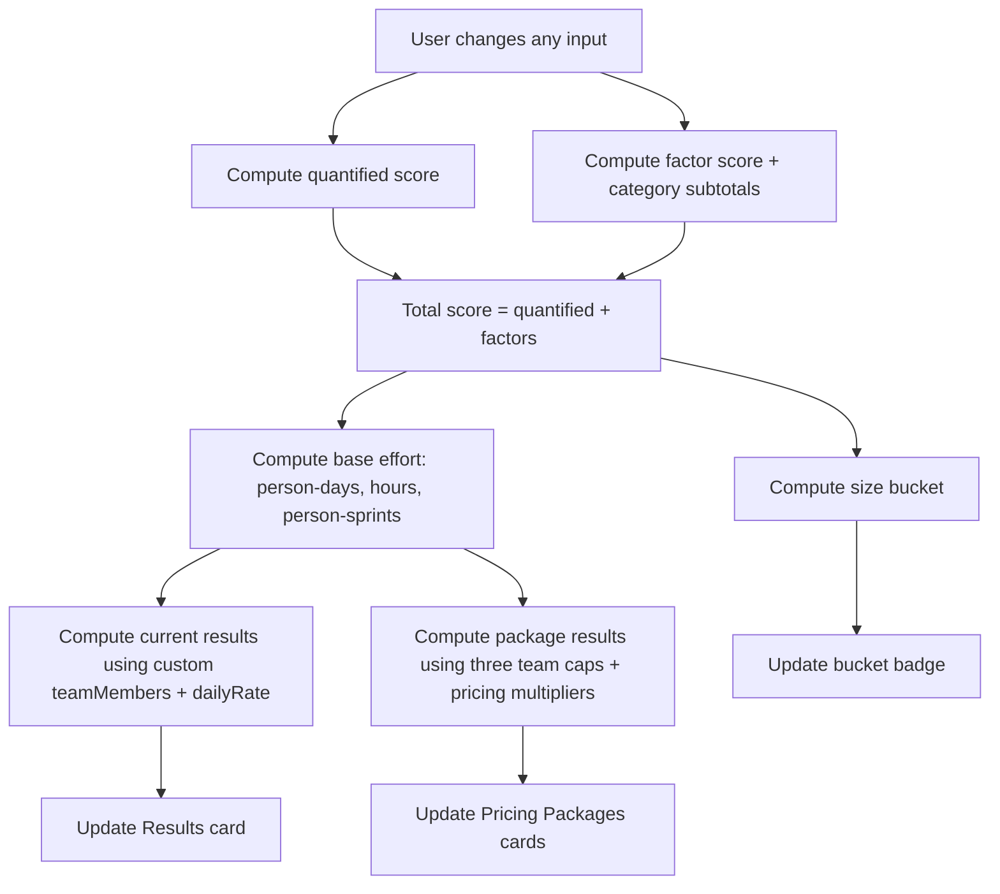

# Migration Sizing Tool Enhancement With Three Pricing Packages

## Executive summary

Your current sizing tool already has the right foundation: a transparent **score → effort → cost** pipeline, with **quantified ranges** (dropdowns) and **boolean complexity factors** (checkboxes). The main gaps are (a) missing accessibility wiring (the exact issues flagged by axe/Edge) and (b) no formalized “service packages” output layer (Standard/Recommended/Express). fileciteturn0file0 citeturn0search0turn0search1

This report proposes a minimal-change implementation that keeps your existing structure and weights-in-JS approach:

- Add **three pricing package cards** that compute schedule + cost using the same underlying score, but apply **team-size caps** (3/6/9) and **package pricing multipliers**.
- Fix the **axe-critical form labeling** issues by binding `<label for>` to each control and adding hidden labels for table checkboxes. citeturn0search0turn0search1
- Keep the tool manager-review-friendly by continuing to render the weights table from the same `WEIGHTS` object, with a clear migration path to “enum files” later.

For migration sizing best practice alignment: the factors you’re modeling (downtime tolerance, workload dependencies, application code readiness, and database dependency mapping) are directly called out by cloud adoption guidance as major drivers of migration sequencing and effort. citeturn1search1turn1search2turn1search5turn1search3

## Assumptions and source coverage

### Assumptions used in the package formulas

Because “pricing packages” weren’t fully specified beyond team caps, the formulas below assume:

- The existing **Daily Rate** input is the baseline blended rate for the **Recommended** package.
- Standard and Express apply pricing multipliers to that baseline (discount vs rush premium).
- The “calendar sprints” math assumes **full utilization** of each team up to the cap (best-case schedule compression); real-world delivery may be longer due to onboarding, coordination overhead, and external dependencies (vendors, security approvals, change windows).
- Sprint duration (e.g., 2 weeks) is not specified; the tool measures “sprints” as a unit of capacity based on the existing `sprintHours` input.
- Currency/locale stay as currently shown (USD-style formatting) unless you later add a region/currency selector.

### Connector coverage and limitations

You requested starting with the GitHub connector repo **SLAFOUNTAINcfs/PowerCalculator**. Using the enabled GitHub connector, that repository was not accessible in the installed scope. The only accessible repository returned was **SLAFOUNTAINcfs/EasySizingTool**, which appears empty (size 0) and therefore did not provide additional code to analyze. No further GitHub-source code could be used as a primary reference.

Primary inputs for the current tool behavior therefore come from the user-provided `autosizingtool.html` and `migrationtool.css`. fileciteturn0file0 fileciteturn0file2

External sources used for rigor:
- axe/Deque accessibility rules for form labels and select accessible names. citeturn0search0turn0search1
- Pricing-card UX patterns and “Recommended” highlighting guidance. citeturn2search6turn1search0
- Cloud migration assessment and planning guidance (dependencies, downtime strategy, assessment). citeturn1search1turn1search2turn1search5turn1search3

## Current tool inputs mapped to scoring and weights

### How scoring works today

The current scoring model in `autosizingtool.html` is:

- **Quantified score** = sum of numeric `<option value="…">` selections for `q_users`, `q_data`, `q_vms`, `q_dbs`, `q_uptime`, `q_integrations`.
- **Factor score** = sum of `WEIGHTS.factors[<key>].weight` for each checked checkbox with `data-factor="<key>"`.
- **Total score** = quantified score + factor score.
- The tool also computes category subtotals by key prefix: `infra_`, `sec_`, `app_`, `db_`. fileciteturn0file0

This aligns well with assessment guidance emphasizing that accurate workload planning requires visibility into architecture, code readiness, databases, and dependencies (which your quantified and factor inputs approximate). citeturn1search2turn1search5

### Deliverable 1: quantified fields mapping

| UI label | Control ID | Scoring method | Current value bands (score contribution) |
|---|---|---|---|
| Active Users | `q_users` | dropdown numeric value | 1–10 (1), 11–50 (3), 51–250 (6), 251–1000 (9), 1000+ (12) fileciteturn0file0 |
| Total Data Size | `q_data` | dropdown numeric value | 0–100GB (2), 100–500GB (5), 500GB–2TB (8), 2TB+ (12) fileciteturn0file0 |
| VM Count | `q_vms` | dropdown numeric value | 1–2 (2), 3–5 (5), 6–15 (9), 16+ (14) fileciteturn0file0 |
| Database Count | `q_dbs` | dropdown numeric value | 1 (2), 2–3 (5), 4–10 (8), 10+ (12) fileciteturn0file0 |
| Uptime Requirement | `q_uptime` | dropdown numeric value | Business Hours (2), 99% (5), 99.9% (8), 99.99% (12) fileciteturn0file0 |
| Integration Count | `q_integrations` | dropdown numeric value | 0–2 (1), 3–5 (4), 6–10 (7), 11+ (12) fileciteturn0file0 |

### Deliverable 1: boolean factors mapping

The factor list below is a direct reflection of the `WEIGHTS.factors` object and the checkboxes (`data-factor="…"`) currently rendered in the tool. fileciteturn0file0

| Category | Key | UI label | Weight |
|---|---|---|---:|
| Infrastructure | `infra_expressroute` | ExpressRoute Required | 8 |
| Infrastructure | `infra_hybrid` | Hybrid Connectivity Required | 6 |
| Infrastructure | `infra_lb` | Load Balancer Migration Required | 5 |
| Infrastructure | `infra_firewall` | Firewall Rule Rebuild Required | 5 |
| Infrastructure | `infra_segmentation` | Custom Network Segmentation Required | 4 |
| Infrastructure | `infra_ha` | Multi-Region / HA Required | 7 |
| Infrastructure | `infra_zerodowntime` | Zero-Downtime Cutover Required | 10 |
| Infrastructure | `infra_dr` | Backup/DR Must Be Built or Reworked | 6 |
| Infrastructure | `infra_monitoring` | Monitoring/Logging Must Be Built or Reworked | 5 |
| Security & Identity | `sec_identity` | Identity Integration Required | 6 |
| Security & Identity | `sec_rbac` | RBAC Model Must Be Designed/Reworked | 5 |
| Security & Identity | `sec_secrets` | Secrets Must Be Migrated to Secure Store | 4 |
| Security & Identity | `sec_tls` | TLS Configuration Required | 3 |
| Security & Identity | `sec_encryption` | Encryption Uplift Required | 5 |
| Security & Identity | `sec_compliance` | Security Auditing/Compliance Validation Required | 7 |
| Application Engineering | `app_refactor` | Application Refactoring Required | 9 |
| Application Engineering | `app_framework` | Framework Upgrade Required | 6 |
| Application Engineering | `app_container` | Containerization Required | 7 |
| Application Engineering | `app_cicd` | CI/CD Pipeline Must Be Created/Reworked | 5 |
| Application Engineering | `app_dependencies` | Dependency Mapping/Rework Required | 5 |
| Application Engineering | `app_vendor` | Vendor Coordination Required | 4 |
| Database | `db_migrate` | Database Migration Required | 7 |
| Database | `db_refactor` | Database Refactoring Required | 8 |
| Database | `db_cluster` | DB Cluster/Replication Architecture Change | 6 |
| Database | `db_transform` | Data Transformation Required | 6 |
| Database | `db_perf` | Performance/IOPS Re-Engineering Required | 7 |

Cloud migration planning guidance explicitly highlights that downtime strategy (downtime vs near-zero downtime), application code readiness, and database dependency mapping materially affect migration design and execution effort—exactly the kinds of drivers this factor list is trying to capture. citeturn1search1turn1search2

## Pricing packages model

### Deliverable 2: package definitions and formulas

You want three packages primarily differentiated by **team size cap**:

- Standard: up to 3 people
- Recommended: up to 6 people
- Express: up to 9 people

However, if the cost is strictly “person-days × rate,” increasing team size only compresses schedule; it doesn’t automatically change cost. To make packages meaningful commercially, this report assumes each package has a **pricing multiplier** applied to the baseline **Daily Rate** (Recommended baseline). This is consistent with common pricing-table guidance: clearly differentiate plans, highlight the recommended plan, and make the price visually primary. citeturn1search0turn2search6

#### Core sizing math (existing model)

Let:

- `S` = Total Score
- `B` = Base Person-Days per Point (existing `basePersonDays`)
- `R` = Baseline Daily Rate (existing `dailyRate`)
- `H` = Hours per Person-Day (existing `hoursPerDay`)
- `SH` = Sprint hours capacity per sprint per person (existing `sprintHours`)

Then:

- **PersonDays** = `S × B`
- **TotalHours** = `PersonDays × H`
- **PersonSprints** = `TotalHours ÷ SH` (if `SH > 0`)

This is how the tool currently works. fileciteturn0file0

#### Package layer math (new)

For each package `p`:

- `Cap_p` = team size cap (3/6/9)
- `M_p` = pricing multiplier applied to the baseline daily rate

Proposed defaults:

| Package | Team cap (`Cap_p`) | Pricing multiplier (`M_p`) | Interpretation |
|---|---:|---:|---|
| Standard | 3 | 0.95 | Slight discount, slower timeline |
| Recommended | 6 | 1.00 | Baseline blended rate and team size |
| Express | 9 | 1.20 | Rush premium + staffing priority |

Then:

- **PackageDailyRate** = `R × M_p`
- **PackageCost** = `PersonDays × PackageDailyRate`
- **PackageCalendarSprints** = `PersonSprints ÷ Cap_p` (if `Cap_p > 0`)

This package layer keeps the score/effort model constant (scope doesn’t magically change) while producing package-distinct pricing and schedule outputs.

### Why these packages align with migration realities

Migration planning guidance emphasizes decisions that directly influence schedule complexity (downtime method, validation, remediation, dependency handling). Faster delivery often implies higher cost (priority staffing, overlapping workstreams, increased coordination). Azure guidance explicitly distinguishes simpler downtime migrations vs near-zero-downtime migrations as requiring additional cutover techniques and ongoing synchronization. citeturn1search1

AWS portfolio discovery guidance also emphasizes progressive discovery and avoiding analysis paralysis—meaning any estimator should remain simple, defensible, and calibratable, rather than pretending to be perfectly predictive. citeturn1search5turn1search3

## Implementation specification

### Deliverable 3: calculation flow



### Deliverable 3: HTML snippets

#### Insert three package cards under Results

Place this after your existing **Results** card (recommended), or inside it under the current metric grid. The markup is designed to scan quickly: plan name, price, then a small set of key metrics—consistent with pricing-table best practices. citeturn1search0turn2search6

```html
<!-- Service Packages -->
<div class="card">
  <h2>Service Packages</h2>
  <p class="desc">
    Same scope score, different staffing caps and pricing multipliers.
    Calendar sprints assume full utilization up to the cap.
  </p>

  <div class="pricing-grid" role="list" aria-label="Service packages">
    <!-- Standard -->
    <section class="pricing-card" role="listitem" aria-labelledby="pkg-standard-title">
      <header class="pricing-header">
        <h3 id="pkg-standard-title">Standard</h3>
        <div class="pricing-sub">Up to <strong>3</strong> people</div>
      </header>

      <div class="pricing-price">
        <div class="pricing-price-label">Estimated Cost</div>
        <div class="pricing-price-value">
          <span class="pricing-currency">$</span><span id="pkg-standard-cost">0</span>
        </div>
      </div>

      <dl class="pricing-kv">
        <div class="pricing-kv-row"><dt>Daily rate</dt><dd id="pkg-standard-rate">$0</dd></div>
        <div class="pricing-kv-row"><dt>Person-days</dt><dd id="pkg-standard-days">0</dd></div>
        <div class="pricing-kv-row"><dt>Total hours</dt><dd id="pkg-standard-hours">0</dd></div>
        <div class="pricing-kv-row"><dt>Person-sprints</dt><dd id="pkg-standard-personSprints">0</dd></div>
        <div class="pricing-kv-row"><dt>Calendar sprints</dt><dd id="pkg-standard-calendarSprints">0</dd></div>
      </dl>
    </section>

    <!-- Recommended -->
    <section class="pricing-card pricing-featured" role="listitem" aria-labelledby="pkg-recommended-title">
      <header class="pricing-header">
        <div class="pricing-badge" aria-hidden="true">Recommended</div>
        <h3 id="pkg-recommended-title">Recommended</h3>
        <div class="pricing-sub">Up to <strong>6</strong> people</div>
      </header>

      <div class="pricing-price">
        <div class="pricing-price-label">Estimated Cost</div>
        <div class="pricing-price-value">
          <span class="pricing-currency">$</span><span id="pkg-recommended-cost">0</span>
        </div>
      </div>

      <dl class="pricing-kv">
        <div class="pricing-kv-row"><dt>Daily rate</dt><dd id="pkg-recommended-rate">$0</dd></div>
        <div class="pricing-kv-row"><dt>Person-days</dt><dd id="pkg-recommended-days">0</dd></div>
        <div class="pricing-kv-row"><dt>Total hours</dt><dd id="pkg-recommended-hours">0</dd></div>
        <div class="pricing-kv-row"><dt>Person-sprints</dt><dd id="pkg-recommended-personSprints">0</dd></div>
        <div class="pricing-kv-row"><dt>Calendar sprints</dt><dd id="pkg-recommended-calendarSprints">0</dd></div>
      </dl>
    </section>

    <!-- Express -->
    <section class="pricing-card" role="listitem" aria-labelledby="pkg-express-title">
      <header class="pricing-header">
        <h3 id="pkg-express-title">Express</h3>
        <div class="pricing-sub">Up to <strong>9</strong> people</div>
      </header>

      <div class="pricing-price">
        <div class="pricing-price-label">Estimated Cost</div>
        <div class="pricing-price-value">
          <span class="pricing-currency">$</span><span id="pkg-express-cost">0</span>
        </div>
      </div>

      <dl class="pricing-kv">
        <div class="pricing-kv-row"><dt>Daily rate</dt><dd id="pkg-express-rate">$0</dd></div>
        <div class="pricing-kv-row"><dt>Person-days</dt><dd id="pkg-express-days">0</dd></div>
        <div class="pricing-kv-row"><dt>Total hours</dt><dd id="pkg-express-hours">0</dd></div>
        <div class="pricing-kv-row"><dt>Person-sprints</dt><dd id="pkg-express-personSprints">0</dd></div>
        <div class="pricing-kv-row"><dt>Calendar sprints</dt><dd id="pkg-express-calendarSprints">0</dd></div>
      </dl>
    </section>
  </div>
</div>
```

### Deliverable 3: accessibility fixes

Your Edge/axe errors are precisely what Deque’s rules describe:

- **`select-name`**: each `<select>` must have an accessible name. The recommended fix is an explicit `<label for="...">` association. citeturn0search1
- **`label`**: each form control (including checkboxes) must have an associated label; placeholder text is not sufficient. citeturn0search0turn0search3

#### Fix pattern for inputs/selects

```html
<label for="q_users">Active Users</label>
<select id="q_users" data-quant="q_users">
  ...
</select>
```

Apply that to *every* `<input>`, `<select>`, and `<textarea>` in `autosizingtool.html`. This resolves the select-name and label issues without changing your layout. citeturn0search0turn0search1

#### Fix pattern for checkbox cells in a table

Right now, your checkbox is visually “labeled” by the first column, but it isn’t programmatically labeled. Add an `id` to the checkbox and include a visually-hidden label.

```html
<tr>
  <td>ExpressRoute Required</td>
  <td class="centered-cell">
    <input id="factor-infra-expressroute" type="checkbox" data-factor="infra_expressroute" />
    <label for="factor-infra-expressroute" class="visually-hidden">ExpressRoute Required</label>
  </td>
</tr>
```

This matches the Deque recommendation for explicit `for`/`id` association. citeturn0search0turn0search3

#### Remove inline styles (Edge webhint)

Your HTML includes inline styles like `style="width:120px"` and `style="grid-column: 1 / -1;"`. Replace them with CSS helper classes (`.w-120`, `.full-width`) for cleaner structure and fewer lint nags. fileciteturn0file0

### Deliverable 3: CSS helper classes

Add these to `migrationtool.css` (you already have `.visually-hidden`; keep it and add helper classes + pricing styles). fileciteturn0file2

```css
/* Replace inline styles */
.w-120 { width: 120px; }
.full-width { grid-column: 1 / -1; }

/* Pricing packages */
.pricing-grid {
  display: grid;
  grid-template-columns: repeat(auto-fit, minmax(240px, 1fr));
  gap: 0.75rem;
}

.pricing-card {
  background: #020617;
  border: 1px solid #1f2937;
  border-radius: 0.75rem;
  padding: 1rem;
  box-shadow: 0 10px 25px rgba(0,0,0,0.35);
}

.pricing-featured {
  border-color: #38bdf8;
}

.pricing-header {
  display: flex;
  flex-direction: column;
  gap: 0.25rem;
  margin-bottom: 0.75rem;
}

.pricing-badge {
  display: inline-block;
  width: fit-content;
  padding: 0.15rem 0.5rem;
  border-radius: 999px;
  border: 1px solid #38bdf8;
  color: #38bdf8;
  font-size: 0.75rem;
}

.pricing-sub {
  color: #9ca3af;
  font-size: 0.85rem;
}

.pricing-price {
  margin: 0.5rem 0 0.75rem 0;
}

.pricing-price-label {
  color: #9ca3af;
  font-size: 0.75rem;
  text-transform: uppercase;
  letter-spacing: 0.05em;
}

.pricing-price-value {
  font-size: 1.4rem;
  font-weight: 700;
}

.pricing-currency {
  margin-right: 0.15rem;
}

.pricing-kv {
  margin: 0;
}

.pricing-kv-row {
  display: flex;
  justify-content: space-between;
  gap: 0.75rem;
  padding: 0.25rem 0;
  border-bottom: 1px solid #1f2937;
}

.pricing-kv-row:last-child {
  border-bottom: none;
}

.pricing-kv dt {
  color: #9ca3af;
  font-size: 0.85rem;
}

.pricing-kv dd {
  margin: 0;
  font-weight: 600;
}
```

### Deliverable 3: full updated JS code

This is a “copy/paste replacement” for your current `<script>` block. It:

- Preserves your existing scoring behavior (`WEIGHTS`, subtotals, bucket).
- Preserves your existing Results panel (custom `teamMembers` + base daily rate).
- Adds package computations and populates the three pricing cards shown above.
- Keeps weights in JS and keeps the Manager Review table.

```javascript
// =============================
// Weights in code (for review)
// TODO: move to enum file later
// =============================
const WEIGHTS = {
  quantifiedKeys: ["q_users", "q_data", "q_vms", "q_dbs", "q_uptime", "q_integrations"],
  factors: {
    infra_expressroute: { label: "ExpressRoute Required", category: "Infrastructure", weight: 8 },
    infra_hybrid: { label: "Hybrid Connectivity Required", category: "Infrastructure", weight: 6 },
    infra_lb: { label: "Load Balancer Migration Required", category: "Infrastructure", weight: 5 },
    infra_firewall: { label: "Firewall Rule Rebuild Required", category: "Infrastructure", weight: 5 },
    infra_segmentation: { label: "Custom Network Segmentation Required", category: "Infrastructure", weight: 4 },
    infra_ha: { label: "Multi-Region / HA Required", category: "Infrastructure", weight: 7 },
    infra_zerodowntime: { label: "Zero-Downtime Cutover Required", category: "Infrastructure", weight: 10 },
    infra_dr: { label: "Backup/DR Must Be Built or Reworked", category: "Infrastructure", weight: 6 },
    infra_monitoring: { label: "Monitoring/Logging Must Be Built or Reworked", category: "Infrastructure", weight: 5 },

    sec_identity: { label: "Identity Integration Required", category: "Security & Identity", weight: 6 },
    sec_rbac: { label: "RBAC Model Must Be Designed/Reworked", category: "Security & Identity", weight: 5 },
    sec_secrets: { label: "Secrets Must Be Migrated to Secure Store", category: "Security & Identity", weight: 4 },
    sec_tls: { label: "TLS Configuration Required", category: "Security & Identity", weight: 3 },
    sec_encryption: { label: "Encryption Uplift Required", category: "Security & Identity", weight: 5 },
    sec_compliance: { label: "Security Auditing/Compliance Validation Required", category: "Security & Identity", weight: 7 },

    app_refactor: { label: "Application Refactoring Required", category: "Application Engineering", weight: 9 },
    app_framework: { label: "Framework Upgrade Required", category: "Application Engineering", weight: 6 },
    app_container: { label: "Containerization Required", category: "Application Engineering", weight: 7 },
    app_cicd: { label: "CI/CD Pipeline Must Be Created/Reworked", category: "Application Engineering", weight: 5 },
    app_dependencies: { label: "Dependency Mapping/Rework Required", category: "Application Engineering", weight: 5 },
    app_vendor: { label: "Vendor Coordination Required", category: "Application Engineering", weight: 4 },

    db_migrate: { label: "Database Migration Required", category: "Database", weight: 7 },
    db_refactor: { label: "Database Refactoring Required", category: "Database", weight: 8 },
    db_cluster: { label: "DB Cluster/Replication Architecture Change", category: "Database", weight: 6 },
    db_transform: { label: "Data Transformation Required", category: "Database", weight: 6 },
    db_perf: { label: "Performance/IOPS Re-Engineering Required", category: "Database", weight: 7 },
  }
};

// =============================
// Pricing packages configuration
// =============================
const PACKAGES = [
  { key: "standard", name: "Standard", teamCap: 3, rateMultiplier: 0.95 },
  { key: "recommended", name: "Recommended", teamCap: 6, rateMultiplier: 1.00, featured: true },
  { key: "express", name: "Express", teamCap: 9, rateMultiplier: 1.20 }
];

function getNumber(id, fallback = 0) {
  const el = document.getElementById(id);
  if (!el) return fallback;
  const v = parseFloat(el.value);
  return Number.isFinite(v) ? v : fallback;
}

function setBadgeClass(bucket) {
  const el = document.getElementById("sizeBucket");
  if (!el) return;
  el.className = "pill";
  const map = { XS:"badge-xs", S:"badge-s", M:"badge-m", L:"badge-l", XL:"badge-xl", XXL:"badge-xxl", XXXL:"badge-xxxl" };
  if (map[bucket]) el.classList.add(map[bucket]);
}

function computeBucket(score) {
  const xs = getNumber("xsThreshold", 20);
  const s  = getNumber("sThreshold", 40);
  const m  = getNumber("mThreshold", 60);
  const l  = getNumber("lThreshold", 80);
  const xl = getNumber("xlThreshold", 100);
  const xxl= getNumber("xxlThreshold", 130);

  if (score <= 0) return "–";
  if (score < xs) return "XS";
  if (score < s)  return "S";
  if (score < m)  return "M";
  if (score < l)  return "L";
  if (score < xl) return "XL";
  if (score < xxl)return "XXL";
  return "XXXL";
}

function computeQuantifiedScore() {
  let total = 0;
  WEIGHTS.quantifiedKeys.forEach(key => {
    const sel = document.querySelector(`[data-quant="${key}"]`);
    if (!sel) return;
    const v = parseFloat(sel.value);
    if (Number.isFinite(v)) total += v;
  });
  return total;
}

function computeFactorScoreAndSubtotals() {
  let total = 0;
  const subs = { infra: 0, sec: 0, app: 0, db: 0 };

  document.querySelectorAll('input[type="checkbox"][data-factor]').forEach(cb => {
    if (!cb.checked) return;
    const k = cb.dataset.factor;
    const def = WEIGHTS.factors[k];
    if (!def) return;

    total += def.weight;
    if (k.startsWith("infra_")) subs.infra += def.weight;
    else if (k.startsWith("sec_")) subs.sec += def.weight;
    else if (k.startsWith("app_")) subs.app += def.weight;
    else if (k.startsWith("db_")) subs.db += def.weight;
  });

  return { total, subs };
}

function formatMoney(n) {
  if (!Number.isFinite(n)) return "$0";
  return "$" + Math.round(n).toLocaleString();
}

function formatRate(n) {
  if (!Number.isFinite(n)) return "$0";
  return "$" + Math.round(n).toLocaleString();
}

function renderWeightsTable() {
  const body = document.getElementById("weightsTableBody");
  if (!body) return;

  const rows = Object.entries(WEIGHTS.factors)
    .map(([key, v]) => ({ key, ...v }))
    .sort((a, b) => (a.category + a.key).localeCompare(b.category + b.key));

  body.innerHTML = rows.map(r => `
    <tr>
      <td>${escapeHtml(r.category)}</td>
      <td><code>${escapeHtml(r.key)}</code></td>
      <td>${escapeHtml(r.label)}</td>
      <td class="centered-cell">${r.weight}</td>
    </tr>
  `).join("");
}

function escapeHtml(s) {
  return String(s)
    .replaceAll("&", "&amp;")
    .replaceAll("<", "&lt;")
    .replaceAll(">", "&gt;")
    .replaceAll('"', "&quot;")
    .replaceAll("'", "&#039;");
}

function updatePackageCards(base) {
  // base = { personDays, totalHours, personSprints, dailyRate, sprintHours, hoursPerDay }
  PACKAGES.forEach(p => {
    const pkgRate = base.dailyRate * p.rateMultiplier;
    const pkgCost = base.personDays * pkgRate;
    const calendarSprints = (p.teamCap > 0) ? (base.personSprints / p.teamCap) : 0;

    const prefix = `pkg-${p.key}`;

    const costEl = document.getElementById(`${prefix}-cost`);
    const rateEl = document.getElementById(`${prefix}-rate`);
    const daysEl = document.getElementById(`${prefix}-days`);
    const hoursEl = document.getElementById(`${prefix}-hours`);
    const psEl = document.getElementById(`${prefix}-personSprints`);
    const csEl = document.getElementById(`${prefix}-calendarSprints`);

    if (costEl) costEl.textContent = Math.round(pkgCost).toLocaleString();
    if (rateEl) rateEl.textContent = formatRate(pkgRate);
    if (daysEl) daysEl.textContent = base.personDays.toFixed(1);
    if (hoursEl) hoursEl.textContent = base.totalHours.toFixed(1);
    if (psEl) psEl.textContent = base.personSprints.toFixed(2);
    if (csEl) csEl.textContent = calendarSprints.toFixed(2);
  });
}

function calculate() {
  const quant = computeQuantifiedScore();
  const factor = computeFactorScoreAndSubtotals();
  const totalScore = quant + factor.total;

  // Score outputs
  const quantEl = document.getElementById("quantScore");
  const factorEl = document.getElementById("factorScore");
  const totalEl = document.getElementById("totalScore");

  if (quantEl) quantEl.textContent = quant.toFixed(1);
  if (factorEl) factorEl.textContent = factor.total.toFixed(1);
  if (totalEl) totalEl.textContent = totalScore.toFixed(1);

  const subInfra = document.getElementById("sub_infra");
  const subSec   = document.getElementById("sub_sec");
  const subApp   = document.getElementById("sub_app");
  const subDb    = document.getElementById("sub_db");

  if (subInfra) subInfra.textContent = factor.subs.infra.toFixed(1);
  if (subSec)   subSec.textContent   = factor.subs.sec.toFixed(1);
  if (subApp)   subApp.textContent   = factor.subs.app.toFixed(1);
  if (subDb)    subDb.textContent    = factor.subs.db.toFixed(1);

  // Bucket
  const bucket = computeBucket(totalScore);
  const bucketEl = document.getElementById("sizeBucket");
  if (bucketEl) bucketEl.textContent = bucket;
  setBadgeClass(bucket);

  // Effort/cost model parameters
  const basePersonDaysPerPoint = getNumber("basePersonDays", 0.4);
  const dailyRateBase = getNumber("dailyRate", 1200);
  const hoursPerDay = getNumber("hoursPerDay", 6);
  const sprintHours = getNumber("sprintHours", 60);
  const teamMembers = getNumber("teamMembers", 3);

  // Base effort
  const personDays = totalScore * basePersonDaysPerPoint;
  const totalHours = personDays * hoursPerDay;
  const personSprints = (sprintHours > 0) ? (totalHours / sprintHours) : 0;

  // Current "Results" card (custom teamMembers)
  const calendarSprints = (teamMembers > 0) ? (personSprints / teamMembers) : 0;
  const cost = personDays * dailyRateBase;

  const daysOut = document.getElementById("estimatedPersonDays");
  const hoursOut = document.getElementById("totalHours");
  const psOut = document.getElementById("personSprints");
  const csOut = document.getElementById("calendarSprints");
  const costOut = document.getElementById("estimatedCost");

  if (daysOut) daysOut.textContent = personDays.toFixed(1);
  if (hoursOut) hoursOut.textContent = totalHours.toFixed(1);
  if (psOut) psOut.textContent = personSprints.toFixed(2);
  if (csOut) csOut.textContent = calendarSprints.toFixed(2);
  if (costOut) costOut.textContent = formatMoney(cost);

  // Package cards
  updatePackageCards({
    personDays,
    totalHours,
    personSprints,
    dailyRate: dailyRateBase,
    sprintHours,
    hoursPerDay
  });
}

function resetDefaults() {
  // Clear metadata text fields (leave selects as-is)
  ["appName", "appOwner", "decisionMakerStrategy", "decisionMakerImplementation", "notes"].forEach(id => {
    const el = document.getElementById(id);
    if (el) el.value = "";
  });

  // Quantified dropdowns to first option
  WEIGHTS.quantifiedKeys.forEach(k => {
    const sel = document.querySelector(`[data-quant="${k}"]`);
    if (sel) sel.selectedIndex = 0;
  });

  // Uncheck factors
  document.querySelectorAll('input[type="checkbox"][data-factor]').forEach(cb => cb.checked = false);

  // Defaults for model
  const setIfExists = (id, v) => { const el = document.getElementById(id); if (el) el.value = v; };

  setIfExists("basePersonDays", 0.40);
  setIfExists("dailyRate", 1200);
  setIfExists("hoursPerDay", 6);
  setIfExists("sprintHours", 60);
  setIfExists("teamMembers", 3);

  setIfExists("xsThreshold", 20);
  setIfExists("sThreshold", 40);
  setIfExists("mThreshold", 60);
  setIfExists("lThreshold", 80);
  setIfExists("xlThreshold", 100);
  setIfExists("xxlThreshold", 130);

  calculate();
}

function hookInputs() {
  document.querySelectorAll("input, select").forEach(el => {
    el.addEventListener("change", calculate);
    el.addEventListener("keyup", calculate);
  });

  const resetBtn = document.getElementById("resetBtn");
  if (resetBtn) resetBtn.addEventListener("click", resetDefaults);
}

document.addEventListener("DOMContentLoaded", () => {
  renderWeightsTable();
  hookInputs();
  calculate();
});
```

## Plan to migrate weights to enums later

### Deliverable 4: pragmatic migration plan

You said you want weights handled in an enum eventually, but need them in code now for manager verification. The key is to migrate without breaking DOM bindings (`data-factor` keys, quantified IDs).

A practical approach that preserves current behavior:

1. **Freeze keys as “enum-like constants” first**  
   Keep `infra_expressroute`, `sec_identity`, etc. as the canonical identifiers. In plain JS, your “enum” is effectively the set of string keys in `WEIGHTS.factors`. This avoids breaking the HTML `data-factor` attributes.

2. **Move `WEIGHTS` into a dedicated module file**  
   Create `weights.enum.js` that exports `WEIGHTS`. If you want zero-build and max compatibility, include it as a `<script>` that sets `window.WEIGHTS_ENUM = {...}` before your main script.

3. **Add a compatibility shim**  
   In the main script, read from `window.WEIGHTS_ENUM ?? WEIGHTS` so you can migrate gradually without big-bang edits.

4. **Introduce TypeScript only if/when you want stronger “enum” semantics**  
   If you later adopt a build step, define:
   - `export const enum FactorKey { ... }` or string union types  
   - `Record<FactorKey, FactorDef>` for compile-time coverage  
   This catches missing weights at build time, instead of at runtime.

5. **Lock down manager review**  
   Keep the “Weights (Manager Review)” table rendering from the exported weight object so stakeholders can validate values after every change.

6. **Add regression tests for weights**  
   Even in plain JS, add a minimal test harness (or just a `verifyWeights()` runtime assertion) that checks:
   - Every checkbox `data-factor` exists in weights
   - Every weight is numeric and within a reasonable range (e.g., 0–20)
   - No duplicate IDs in the DOM

## Test cases and QA checklist

### Deliverable 5: scenario input definitions

These test cases use your current defaults: `basePersonDays=0.40`, `hoursPerDay=6`, `sprintHours=60`, `dailyRate=$1200`. fileciteturn0file0

| Scenario | Quantified selections | Factors checked (by key) |
|---|---|---|
| Small | q_users=1, q_data=2, q_vms=2, q_dbs=2, q_uptime=2, q_integrations=1 (TotalScore=10) | none |
| Medium | q_users=6, q_data=5, q_vms=5, q_dbs=5, q_uptime=5, q_integrations=4 (QuantScore=30) | infra_hybrid, infra_dr, sec_identity, app_cicd, db_migrate (FactorScore=30) |
| Large | q_users=12, q_data=12, q_vms=14, q_dbs=12, q_uptime=12, q_integrations=12 (QuantScore=74) | all factors checked (FactorScore=156) |

### Deliverable 5: expected outputs per package

The following table is computed from the formulas in this report:

- PersonDays = TotalScore × 0.40  
- TotalHours = PersonDays × 6  
- PersonSprints = TotalHours ÷ 60  
- CalendarSprints = PersonSprints ÷ TeamCap  
- Cost = PersonDays × (1200 × RateMultiplier)

| Scenario | TotalScore | Package | TeamCap | DailyRate | PersonDays | TotalHours | PersonSprints | CalendarSprints | Cost |
|---|---:|---|---:|---:|---:|---:|---:|---:|---:|
| Small | 10 | Standard | 3 | 1140 | 4.0 | 24.0 | 0.40 | 0.13 | 4,560 |
| Small | 10 | Recommended | 6 | 1200 | 4.0 | 24.0 | 0.40 | 0.07 | 4,800 |
| Small | 10 | Express | 9 | 1440 | 4.0 | 24.0 | 0.40 | 0.04 | 5,760 |
| Medium | 60 | Standard | 3 | 1140 | 24.0 | 144.0 | 2.40 | 0.80 | 27,360 |
| Medium | 60 | Recommended | 6 | 1200 | 24.0 | 144.0 | 2.40 | 0.40 | 28,800 |
| Medium | 60 | Express | 9 | 1440 | 24.0 | 144.0 | 2.40 | 0.27 | 34,560 |
| Large | 230 | Standard | 3 | 1140 | 92.0 | 552.0 | 9.20 | 3.07 | 104,880 |
| Large | 230 | Recommended | 6 | 1200 | 92.0 | 552.0 | 9.20 | 1.53 | 110,400 |
| Large | 230 | Express | 9 | 1440 | 92.0 | 552.0 | 9.20 | 1.02 | 132,480 |

### Deliverable 6: prioritized implementation and QA checklist

**Accessibility (do first, because it’s currently failing):**
- Add explicit label associations for every input/select/textarea: `label[for]` matches control `id`. citeturn0search0turn0search1
- Add visually hidden checkbox labels in the factor tables (each checkbox must have a programmatic name). citeturn0search0turn0search3
- Remove reliance on placeholder text as the only label source (Deque explicitly calls this non-recommended). citeturn0search3
- Run axe again; verify the prior `select-name` and `label` findings are resolved. citeturn0search1turn0search0

**Functionality (prevent silent logic regressions):**
- Confirm `TotalScore = QuantScore + FactorScore` still matches the existing UI outputs. fileciteturn0file0
- Confirm manager weights table still renders from the same `WEIGHTS.factors` mapping.
- Confirm package cards update in real time on any input change (same listeners as current calculate loop).

**UI/UX (keep it scannable):**
- Ensure the Recommended plan is visually distinguished but not “clown car highlighted” (one badge only; make the price most prominent). citeturn2search6turn1search0
- Keep plan differences obvious: team cap + price + timeline (calendar sprints) should be visible without scrolling. citeturn1search0

**Manual testing:**
- Run the provided test scenarios (Small/Medium/Large) and validate the expected outputs table above.
- Try “edge” values: all factors unchecked, all factors checked, sprintHours=0, teamMembers=0, dailyRate empty; verify the UI doesn’t show NaN or crash.

**Future-proofing:**
- Add a simple runtime audit: verify every checkbox `data-factor` exists as a key in `WEIGHTS.factors` (log errors in console if not). This makes later enum refactors safer.
- When moving weights to enums, add a check that the manager review table count matches the number of `data-factor` checkboxes in the DOM.